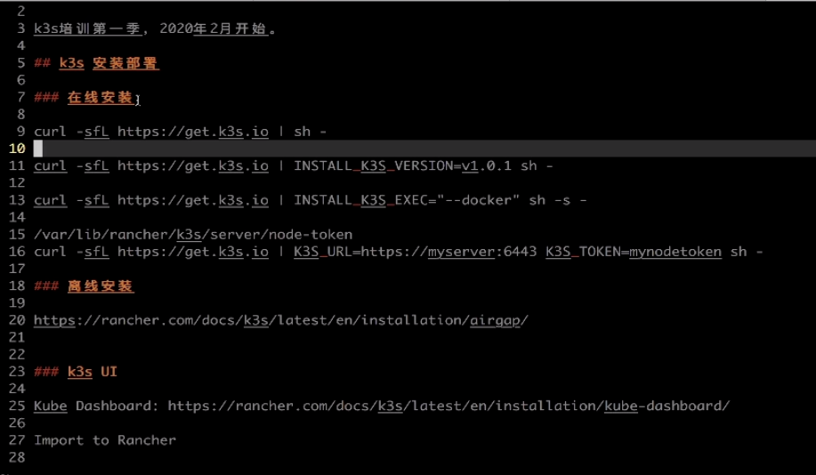
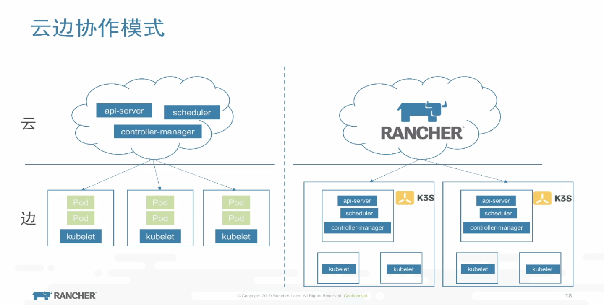
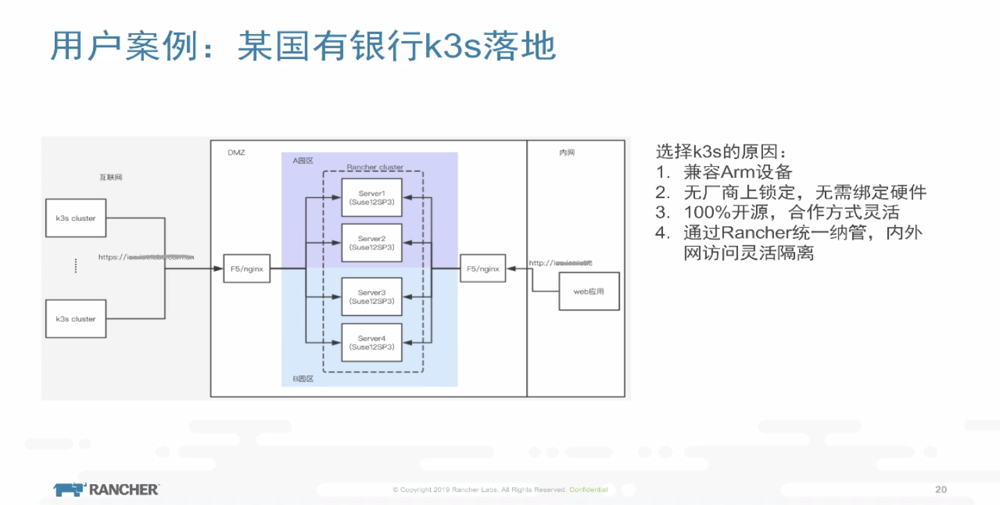
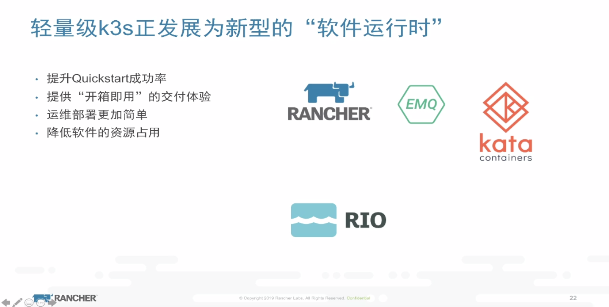
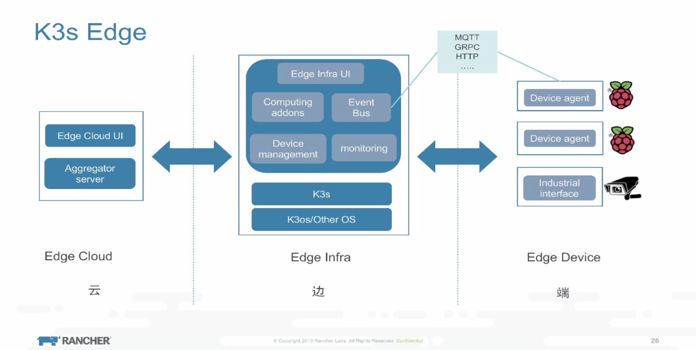
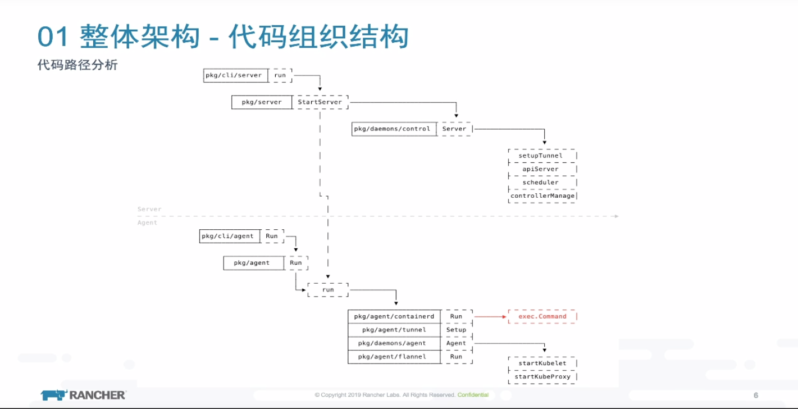

[toc]

# K3s 手记



- 目录：
    - [快速上手](README.md##安装k3s)
    - [离线安装](airgap.md)
    - [wireguard] todo
    - [高可用] todo

---
## docker环境
```
sudo apt-get install docker-ce 

sudo usermod -aG docker ubuntu
```
## ~~安装rancher~~ 非必须
```
docker run -d -v /data/docker/rancher-server/var/lib/rancher/:/var/lib/rancher/ --restart=unless-stopped --name rancher-server -p 180:80 -p 1443:443 rancher/rancher:stable
```


## 安装k3s
### K3s server: 
```
## 国内环境
curl -sfL http://rancher-mirror.rancher.cn/k3s/k3s-install.sh | INSTALL_K3S_MIRROR=cn K3S_KUBECONFIG_OUTPUT=/root/.kube/config sh -

> 默认使用containerd作为容器运行时,使用docker添加: INSTALL_K3S_EXEC="--docker"
> .kube文件cp到其他用户下方便使用，0644 

> docker 方法2
sudo vim /etc/systemd/system/k3s.service
修改成:
    server --docker --no-deploy traefik \ 
    使用docker,禁用traefik
systemctl daemon-reload

service k3s restart
```

获取token

``
sudo cat /var/lib/rancher/k3s/server/token
``

### K3s agent:
```
curl -sfL http://rancher-mirror.rancher.cn/k3s/k3s-install.sh | INSTALL_K3S_MIRROR=cn \
K3S_URL=https://192.168.99.211:6443 \
K3S_TOKEN=9077b8e6f3b67b5f3e4a7723a96b199d \
sh -
```

## 卸载k3s
```
k3s-uninstall.sh
k3s-uninstall-agent.sh
```
# 使用场景






## 参考文档
[你的第一次轻量级K8S体验 —— 记一次Rancher 2.2 + K3S集成部署过程](https://blog.ilemonrain.com/docker/rancher-with-k3s.html)

[轻松玩转K3S多点部署 —— Rancher 2.2 + K3S多点/集群部署教程](https://blog.ilemonrain.com/docker/rancher-with-k3s-multideploy.html)

[部署k3s高可用集群(实验性)](http://willgeek.com/archives/232/) http://willgeek.com/archives/232/

[k3s-轻量级Kubernetes上手](https://dyllanwli.github.io/2019/03/09/k3s-%E8%BD%BB%E9%87%8F%E7%BA%A7Kubernetes%E4%B8%8A%E6%89%8B/)