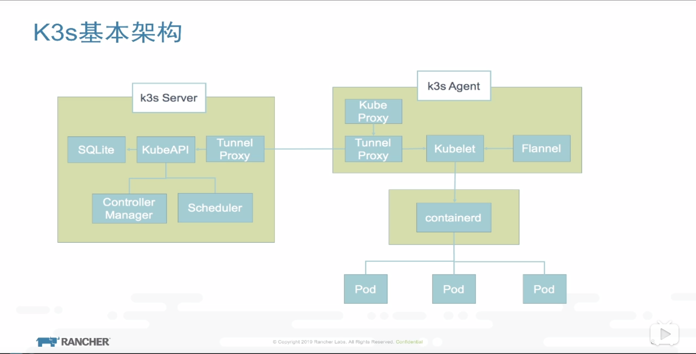

# K3s 手记



## docker环境
```
sudo apt-get install docker-ce 

sudo usermod -aG docker ubuntu
```
## 安装rancher
```
docker run -d -v /data/docker/rancher-server/var/lib/rancher/:/var/lib/rancher/ --restart=unless-stopped --name rancher-server -p 180:80 -p 1443:443 rancher/rancher:stable
```
## 安装k3s
```
wget https://github.com/rancher/k3s/releases/download/v1.17.5%2Bk3s1/k3s

# 备用 
# wget http://cloud.emmmmmm.org/k3s

chmod +x k3s 
sudo mv k3s /usr/local/bin/

docker pull registry.cn-hangzhou.aliyuncs.com/google_containers/pause:3.1 && \
docker tag da86e6ba6ca1 k8s.gcr.io/pause:3.1


# 一键梭哈
curl -sfL https://docs.rancher.cn/k3s/k3s-install.sh | INSTALL_K3S_MIRROR=cn sh -

sudo chmod 666 /etc/rancher/k3s/k3s.yaml

sudo vim /etc/systemd/system/multi-user.target.wants/k3s.service
# 增加docker
> server --docker --no-deploy traefik \

systemctl daemon-reload

service k3s restart

sudo chmod +r /etc/rancher/k3s/k3s.yaml

```

## 获取token
``
sudo cat /var/lib/rancher/k3s/server/node-token
``


# 使用场景


